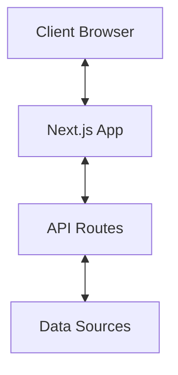
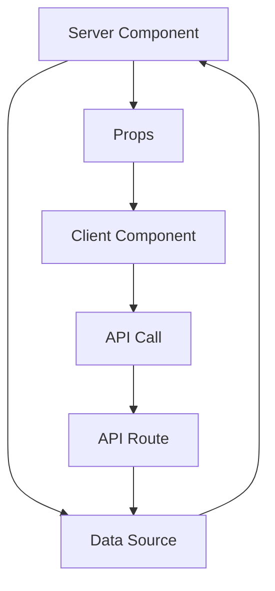

# System Patterns: PokerPortal

## Architecture Overview

PokerPortal uses a modern web application architecture built with Next.js:

### Key Components

1. **Client-Side Application**: React-based frontend with Next.js
2. **Server Components**: Server-rendered React components
3. **API Routes**: Next.js API endpoints for data operations
4. **Data Layer**: Mock data currently, will be replaced with database

## Design Patterns

### Application Structure

The application follows a feature-based organization pattern:

- `src/app`: Next.js App Router structure
  - Page components organized by routes (nearby, favorites, stores)
  - API endpoints under `/api` directory
- `src/components`: Reusable UI components
  - `ui/`: Shadcn UI component library customizations
  - Feature-specific components (e.g., `NearbyStoreMap.tsx`)
- `src/lib`: Shared utilities and services
  - `api.ts`: API interaction logic
  - `hooks.ts`: Custom React hooks
  - `types.ts`: TypeScript interfaces and types
  - `utils.ts`: Helper functions

### Component Patterns

1. **Page Components**: Container components that:
   - Handle route parameters and queries
   - Fetch required data
   - Implement page-level layout
   - Delegate to smaller components

2. **UI Components**: Pure presentational components that:
   - Accept props for data and callbacks
   - Implement consistent styling
   - Follow Shadcn UI patterns where applicable

3. **Data Fetching Pattern**:
   - Server components fetch data directly
   - Client components use custom hooks
   - API routes provide data access endpoints

## State Management

1. **Server State**:
   - Fetched directly in server components
   - Accessed via API routes in client components

2. **UI State**:
   - Local component state for UI-specific concerns
   - URL state for shareable/bookmarkable state

3. **User Preferences**:
   - Favorites stored using client-side persistence
   - Geolocation permissions handled with user consent

## Data Flow

## Authentication Pattern

The application currently doesn't implement authentication but is structured to support it in the future:

- Will use a token-based authentication system
- User preferences currently stored in local storage
- Will transition to user accounts with server-side storage

## Error Handling

1. **Client-Side Errors**:
   - Try/catch for async operations
   - Error boundaries for component failures
   - User-friendly error messages

2. **Server-Side Errors**:
   - Structured error responses from API routes
   - Logging for debugging
   - Graceful degradation

## Responsive Design

1. **Mobile-First Approach**:
   - Designed for mobile devices first
   - Responsive adaptations for larger screens

2. **Layout Components**:
   - Flexible grid systems
   - Responsive navigation
   - Adaptive content presentation

## Performance Optimization

1. **Code Splitting**:
   - Route-based code splitting with Next.js
   - Lazy loading of non-critical components

2. **Image Optimization**:
   - Next.js Image component for optimal delivery
   - SVG usage for simple graphics

3. **Caching Strategy**:
   - Static generation where possible
   - Incremental Static Regeneration for semi-dynamic content
   - Full dynamic rendering for personalized content